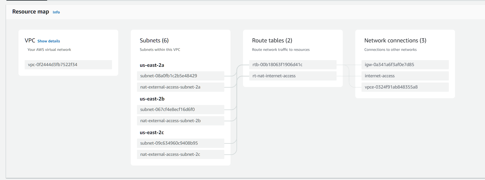

# Elevating your System Design skills with AWS
This is a document created to work as an additional content to the `Elevating your System Design skills` workshop. This will agregatte some of the info discussed during the presentation.

This repository has the intent to work as an overall guide to give you directions about where to go. Intentions here aren't to be exactly step-by-step to every service but to give you a glance about where to connect the dots.

## System Design challenges
Using https://draw.io

### Tips:
- Define the problem space, ask a lot of questions, don't jump into the design before acknowledging it.
  - what's in and out of scope?
  - who are our clients?
  - what are the existing pieces? do we need to talk to pieces of the existing system?
- Design the system at a high level
  - You can start figuring out the API (REST, SOAP, GraphQL, gRPC)
- Deep Dive:
  - *Detailed Exploration*: Once you have the high-level design in place, the deep dive involves a more detailed exploration of each component and subsystem. You delve into the specifics of how each piece of the system will work, considering factors like data flow, algorithms, and interactions between components.
  - Technical Considerations: During the deep dive, you address technical considerations such as scalability, performance, security, and fault tolerance. This phase is crucial for ensuring that the system is robust and can handle potential challenges.
- Wrap Up
  - The wrap-up phase involves creating comprehensive documentation for the system design. This documentation should cover all aspects of the design, including architectural diagrams, data flow charts, component specifications, and any other relevant details.

### Challenge 1 - Crash Report service
Design a game agnostic Crash Report service that allows us to live monitor data from running game servers.

### Challenge 2 - Design a score leaderboards
This is homework. But here goes the considerations for you:
- Use cache, consider high volume of requests.
- Cache can be in instance level and/or request level.
- Consider `stale-while-revalidate` approach
- Is relational data needed?
- Do you need a Load Balancer and several instances?
- Are there routines that could be ran in cronjobs?

## Code challenges

### Challenge 1 - Guess the number 
Write a function that tries to guess a given nubmer using math/rand lib.
Make sure you have a limit of attempts
Make it in a way that uses a loop or recursion.
Write the time complexity

Resolution is here:
`./code-challenge/guessNumber`

### Challenge 2 - Big O practice
Homework.

Write a function that receives an array and print the number of entries `(Linear Time Complexity O(n) )`

Write a function that receives a hash table that contains name as identifier and each node will have a list of pets `(Quadratic Time Complexity O(n^2) ) `. 

## Setup your backend infrastructure
Our infrastructure will be composed by:
- VPC
- ECR
- ECS
- Lambda function
- Redis

We are going to briefly talk about these services. Use this as a reference to our live talk and as a post guide to where to start.

### VPC
Example of VPC that you can replicate:

### ECR - Elastic Container Registry

This is where we are going to host docker images. We can develop our app and then push the app to the AWS cloud

To create a new repository to host our docker container all you gotta do is access ECR under your region in https://us-east-2.console.aws.amazon.com/ecr/private-registry/repositories?region=us-east-2 and hit `Create repository`. This is what you get:

After creating the repository, open it from the list:

And then hit `View push commands`:

This assumes you have AWS-CLI properly connected through `aws configure sso` with `AdministratorAccess`.

### ECS or Elastic Beanstalk
This is where we want to host our actual service. Both options are valid and you can pick which makes more sense for your case.

ECS is serverless, uses Fargate and you don't harry to worry at all about scalability, handling EC2 instances or whatever.

Elastic Beanstalk gives you more control over your app since they are running in EC2 instances and you can access them through SSL and do any modifications as you please.

Using ECS, to create a new app you have to create a new `Cluster`. Clusters will have `Services` and services will have `Tasks`.

This is where you can access ECS service (according to your region):
https://us-east-2.console.aws.amazon.com/ecs/v2/clusters?region=us-east-2

To create your app in Elastic Beanstalk it is also quite simple through https://us-east-2.console.aws.amazon.com/elasticbeanstalk/home?region=us-east-2# 

On Elastic Beanstalk you can create environments and each environment will have applications. It is useful to have separate envs like DEV and PROD with not much work. You can setup along with your app a Code Pipeline for auto deployment.

### Lambda Function
This service can be accessed through:
https://us-west-1.console.aws.amazon.com/lambda/home?region=us-west-1#/begin

This is the easiest and more practical way on running your tasks and routines. It is serverless, fast and easy deployment. For several languages like NodeJs you also have a built-in code editor.

Lambda functions can be triggered in many different forms. For cronjob format you can use `EventBridge` to setup your crons:

### Redis
One of the fastest way to store data and widely used for caching. Redis is a bit more complicated to manage on AWS because they are a private resource, that means you can't access it from outside your VPC. And also your apps gonna need to be in the same VPC to access redis resources.

